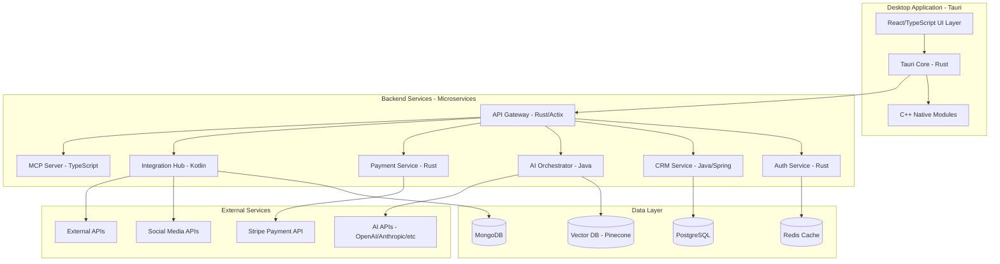
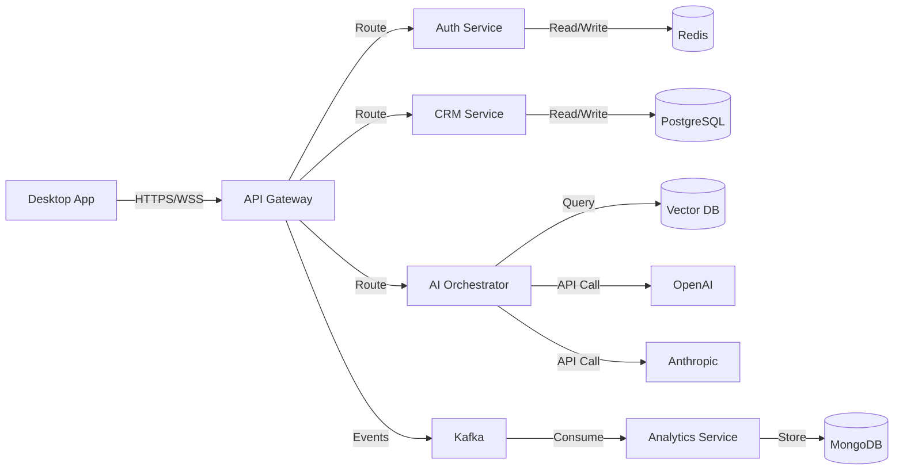
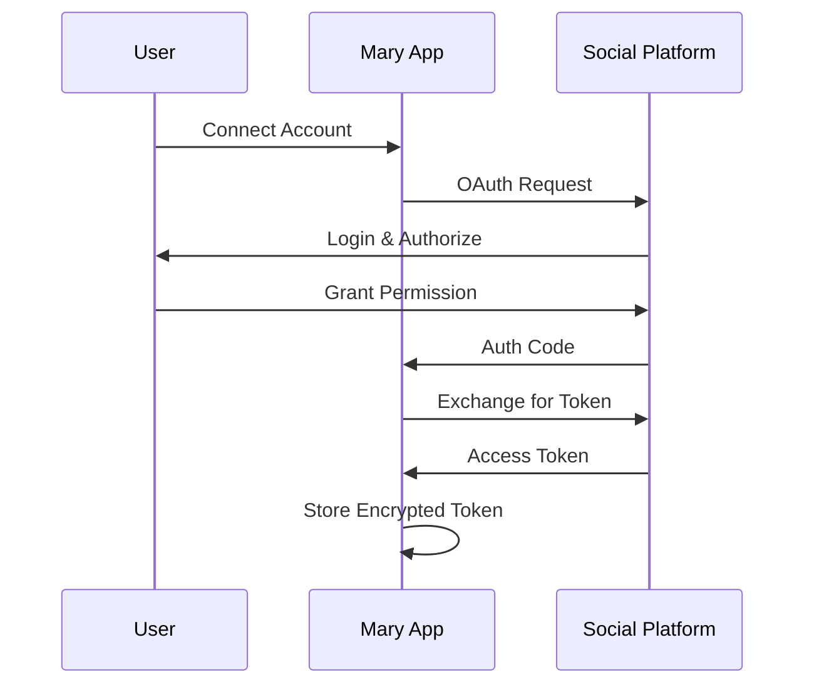
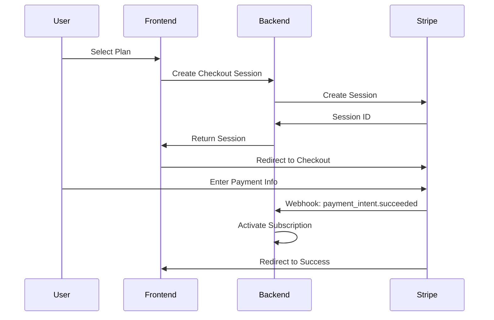

# Mary Platform - Technical Architecture Document

**Version:** 1.0.0  
**Last Updated:** 2025-12-25  
**License:** Apache 2.0  
**Project Location:** C:\Martin\WEB\Mary

---

## Executive Summary

Mary is an enterprise-grade, multi-technology desktop application platform designed for AI agent orchestration, CRM, social media integration, and comprehensive business management. This document outlines the complete technical architecture, technology stack integration, security model, and implementation strategy.

**Core Value Proposition:**
- Unified platform for AI agent management and business operations
- Strong emphasis on cybersecurity and data protection
- Scalable microservices architecture
- Multi-language integration (TypeScript, Rust, C++, Java, Kotlin)
- 3-tier SaaS pricing model (Free, $25/month, $100/month)

---

## Table of Contents

1. [System Overview](#system-overview)
2. [Architecture Patterns](#architecture-patterns)
3. [Technology Stack](#technology-stack)
4. [Component Architecture](#component-architecture)
5. [Data Architecture](#data-architecture)
6. [Security Architecture](#security-architecture)
7. [Scalability Strategy](#scalability-strategy)
8. [Integration Architecture](#integration-architecture)
9. [Development Phases](#development-phases)
10. [Build System](#build-system)
11. [Deployment Strategy](#deployment-strategy)

---

## 1. System Overview

### 1.1 High-Level Architecture



### 1.2 Core Principles

1. **Security First**: Zero-trust security model, end-to-end encryption, PCI-DSS compliance
2. **Modularity**: Loosely coupled microservices, clean interfaces, independent scaling
3. **Performance**: Rust/C++ for critical paths, efficient caching, optimized database queries
4. **Scalability**: Horizontal scaling, event-driven architecture, distributed caching
5. **Maintainability**: Clear separation of concerns, comprehensive documentation, automated testing
6. **Cross-Platform**: Windows, macOS, Linux support via Tauri

---

## 2. Architecture Patterns

### 2.1 Primary Patterns

1. **Microservices Architecture**
   - Independent services with single responsibilities
   - API Gateway for unified access
   - Service discovery and registration
   - Circuit breakers for resilience

2. **Event-Driven Architecture**
   - Apache Kafka for event streaming
   - CQRS (Command Query Responsibility Segregation) for complex operations
   - Event sourcing for audit trails
   - Asynchronous processing for long-running tasks

3. **Layered Architecture (Frontend)**
   - Presentation Layer (React Components)
   - State Management Layer (Redux/Zustand)
   - Service Layer (API Clients)
   - Tauri Bridge Layer (IPC)

4. **Clean Architecture (Backend Services)**
   - Domain Layer (Business Logic)
   - Application Layer (Use Cases)
   - Infrastructure Layer (Database, External APIs)
   - Presentation Layer (REST/GraphQL APIs)

### 2.2 Design Patterns

- **Repository Pattern**: Database access abstraction
- **Factory Pattern**: Service instantiation
- **Strategy Pattern**: AI provider selection
- **Observer Pattern**: Event handling
- **Singleton Pattern**: Configuration management
- **Adapter Pattern**: External API integration
- **Facade Pattern**: Complex subsystem simplification

---

## 3. Technology Stack

### 3.1 Frontend Desktop Application

**Framework:** Tauri v2.x (Rust-based)
- **Rationale**: Superior security, smaller bundle size (~10MB vs 100MB+ for Electron), native performance, Rust integration
- **UI Framework**: React 18+ with TypeScript
- **State Management**: Zustand (lightweight) or Redux Toolkit
- **UI Component Library**: Shadcn/ui (Tailwind CSS-based)
- **Routing**: TanStack Router
- **Forms**: React Hook Form + Zod validation
- **HTTP Client**: Axios with interceptors
- **Real-time**: Socket.io-client
- **Rich Text Editor**: TipTap or Lexical
- **Charts/Visualization**: Recharts, D3.js
- **Icons**: Lucide React

**Build Tools:**
- Vite (fast HMR and builds)
- TypeScript 5.x (strict mode)
- ESLint + Prettier
- Vitest for unit testing
- Playwright for E2E testing

### 3.2 Backend Services

#### 3.2.1 Rust Services (Security & Performance Critical)

**Services:**
- API Gateway (Actix-web)
- Authentication Service (Actix-web + OAuth2)
- Payment Service (Actix-web + Stripe SDK)
- Encryption Service (AES-256-GCM, RSA-2048)

**Key Crates:**
- `actix-web` - High-performance web framework
- `tokio` - Async runtime
- `sqlx` - Type-safe SQL
- `serde` - Serialization
- `jsonwebtoken` - JWT handling
- `argon2` - Password hashing
- `ring` - Cryptography
- `tonic` - gRPC framework

#### 3.2.2 Java Services (Enterprise Business Logic)

**Services:**
- CRM Service (Spring Boot 3.x)
- AI Agent Orchestrator (Spring Boot 3.x)
- Analytics Service (Spring Boot 3.x)

**Stack:**
- Spring Boot 3.2+
- Spring Security (OAuth2/OIDC)
- Spring Data JPA
- Spring Cloud (Gateway, Config, Discovery)
- Hibernate ORM
- JUnit 5 + Mockito
- Maven/Gradle build system

#### 3.2.3 Kotlin Services (Android & JVM Integration)

**Services:**
- Integration Hub (Ktor framework)
- Social Media Connector (Ktor)
- Mobile API Gateway (Ktor)

**Stack:**
- Ktor 2.x (async, lightweight)
- Coroutines for async operations
- Exposed ORM
- KotlinX Serialization
- Arrow for functional programming

#### 3.2.4 TypeScript Services

**Services:**
- MCP (Model Context Protocol) Server (Node.js)
- WebSocket Server (Socket.io)
- Admin Dashboard Backend (Express.js)

**Stack:**
- Node.js 20 LTS
- Express.js or Fastify
- TypeORM or Prisma
- Socket.io for real-time
- Jest for testing

#### 3.2.5 C++ Components (Performance Critical)

**Components:**
- Native file system operations
- High-performance data processing
- Image/video processing
- Database query optimization layer

**Stack:**
- C++20 standard
- Node-API (N-API) for Node.js binding
- Rust FFI for Tauri integration
- CMake build system
- Google Test framework

### 3.3 Data Layer

**Primary Database:** PostgreSQL 16+
- Relational data (users, CRM, transactions)
- JSONB for flexible schemas
- Full-text search
- Partitioning for scalability

**Document Store:** MongoDB 7+
- API integration logs
- Social media data
- Dynamic configuration
- Unstructured data

**Cache Layer:** Redis 7+
- Session storage
- Rate limiting
- Real-time data
- Message queuing (Redis Streams)

**Vector Database:** Pinecone or Weaviate
- AI embeddings storage
- Semantic search
- RAG (Retrieval Augmented Generation) support

**Message Queue:** Apache Kafka
- Event streaming
- Service-to-service communication
- Audit logging
- Real-time analytics pipeline

### 3.4 DevOps & Infrastructure

**Containerization:** Docker + Docker Compose
**Orchestration:** Kubernetes (K8s) for production
**CI/CD:** GitHub Actions or GitLab CI
**Monitoring:** 
- Prometheus (metrics)
- Grafana (dashboards)
- ELK Stack (logging)
- Sentry (error tracking)

**Infrastructure as Code:** Terraform
**Cloud Provider:** AWS, Azure, or GCP (cloud-agnostic design)

---

## 4. Component Architecture

### 4.1 Desktop Application (Tauri)

#### 4.1.1 Frontend Architecture

```
mary-desktop/
├── src/
│   ├── features/               # Feature-based modules
│   │   ├── auth/              # Authentication
│   │   ├── ai-orchestrator/   # AI Agent Management
│   │   ├── crm/              # CRM functionality
│   │   ├── social-media/      # Social media integration
│   │   ├── api-manager/       # Universal API manager
│   │   ├── app-integration/   # Computer apps integration
│   │   ├── client-portal/     # Client-facing interface
│   │   ├── payments/          # Payment processing
│   │   └── admin/            # Admin dashboard
│   ├── shared/                # Shared utilities
│   │   ├── components/       # Reusable UI components
│   │   ├── hooks/           # Custom React hooks
│   │   ├── utils/           # Helper functions
│   │   ├── types/           # TypeScript types
│   │   └── constants/       # Constants
│   ├── store/                # State management
│   ├── services/             # API services
│   ├── layouts/              # Layout components
│   └── App.tsx              # Root component
└── src-tauri/                # Rust backend
    ├── src/
    │   ├── commands/         # Tauri commands (IPC)
    │   ├── security/         # Security modules
    │   ├── system/          # System integration
    │   ├── crypto/          # Local encryption
    │   └── main.rs          # Entry point
    └── Cargo.toml
```

#### 4.1.2 Tauri Backend (Rust)

**Core Responsibilities:**
- Secure IPC between frontend and Rust backend
- Local file system operations
- System tray management
- Auto-updater functionality
- Local encryption/decryption
- Native OS integration
- Hardware access (camera, microphone - with permissions)

**Key Commands:**
```rust
#[tauri::command]
async fn secure_api_call(endpoint: String, data: String) -> Result<String, String>

#[tauri::command]
async fn encrypt_sensitive_data(data: String) -> Result<String, String>

#[tauri::command]
async fn manage_local_storage(operation: String) -> Result<String, String>

#[tauri::command]
async fn integrate_local_app(app_path: String) -> Result<String, String>
```

### 4.2 Backend Microservices

#### 4.2.1 API Gateway (Rust/Actix)

**Responsibilities:**
- Unified API entry point
- Request routing to appropriate services
- Rate limiting and throttling
- Request/response transformation
- API versioning (v1, v2, etc.)
- CORS handling
- Request logging and monitoring

**Technology Rationale:**
Rust chosen for its performance, memory safety, and ability to handle high concurrency without thread-safety issues.

#### 4.2.2 Authentication Service (Rust)

**Responsibilities:**
- User registration and login
- OAuth2/OIDC provider
- JWT token generation and validation
- Multi-factor authentication (MFA)
- Password management (reset, change)
- Session management
- API key management

**Authentication Flow:**
1. User credentials → Hash with Argon2
2. Generate JWT with RS256 signing
3. Store refresh token in Redis (encrypted)
4. Return access token (15 min) + refresh token (7 days)

#### 4.2.3 CRM Service (Java/Spring Boot)

**Responsibilities:**
- Contact management
- Deal pipeline management
- Activity tracking
- Custom fields and views
- Email integration
- Task and calendar management
- Reporting and analytics

**Database Schema:**
- `contacts` - Customer information
- `companies` - Organization data
- `deals` - Sales pipeline
- `activities` - Interactions history
- `custom_fields` - User-defined fields

#### 4.2.4 AI Agent Orchestrator (Java/Spring Boot)

**Responsibilities:**
- AI provider management (OpenAI, Anthropic, Google, etc.)
- Agent creation and configuration
- Task routing to appropriate agents
- Response aggregation
- Cost tracking per provider
- Rate limit management
- Context and memory management
- Vector embeddings for RAG

**Supported AI Providers:**
- OpenAI (GPT-4, GPT-3.5)
- Anthropic (Claude 3.x)
- Google (Gemini)
- Cohere
- Hugging Face
- Self-hosted models (Ollama, LocalAI)

**Agent Types:**
- Chat agents
- Code generation agents
- Data analysis agents
- Content creation agents
- Custom agents (user-defined)

#### 4.2.5 Integration Hub (Kotlin/Ktor)

**Responsibilities:**
- Social media API integration
- Generic API connector framework
- OAuth flow management for external services
- Webhook handler
- Data transformation pipelines
- Connection health monitoring

**Supported Integrations:**
- **Social Media**: Twitter/X, LinkedIn, Facebook, Instagram, TikTok
- **Communication**: Slack, Discord, Telegram, WhatsApp Business
- **Productivity**: Google Workspace, Microsoft 365
- **Generic**: Custom API connections via configuration

#### 4.2.6 Payment Service (Rust)

**Responsibilities:**
- Stripe integration (PCI-compliant)
- Subscription management
- Invoice generation
- Payment method management
- Webhook handling
- Refund processing
- Usage-based billing

**Pricing Tiers:**
```rust
pub enum SubscriptionTier {
    Free,           // $0/month - Basic features
    Professional,   // $25/month - Intermediate features
    Enterprise,     // $100/month - Premium features
}
```

**Feature Matrix:**
| Feature | Free | Professional | Enterprise |
|---------|------|--------------|------------|
| AI Agents | 1 | 5 | Unlimited |
| API Calls/month | 1,000 | 50,000 | Unlimited |
| CRM Contacts | 100 | 5,000 | Unlimited |
| Social Media Accounts | 1 | 10 | Unlimited |
| Storage | 1 GB | 50 GB | 500 GB |
| Support | Community | Email | Priority + Phone |

#### 4.2.7 MCP Server (TypeScript/Node.js)

**Responsibilities:**
- Model Context Protocol implementation
- Tool/resource registration
- Context management for AI agents
- Prompt engineering utilities
- Multi-model coordination

**MCP Components:**
```typescript
interface MCPServer {
  tools: Tool[];
  resources: Resource[];
  prompts: Prompt[];
  context: Context;
}

interface Tool {
  name: string;
  description: string;
  parameters: JsonSchema;
  handler: (params: any) => Promise<any>;
}
```

### 4.3 C++ Native Modules

**Integration Method:** Node-API (N-API) for Node.js, FFI for Rust

**Modules:**
1. **FileSystemOptimizer**: High-speed file operations
2. **ImageProcessor**: Image manipulation (resize, compress, convert)
3. **VideoTranscoder**: Video processing
4. **DataCompressor**: Efficient data compression
5. **CryptoAccelerator**: Hardware-accelerated encryption

**Build Configuration:**
```cpp
// binding.gyp for Node.js modules
{
  "targets": [{
    "target_name": "native_modules",
    "sources": [
      "src/filesystem.cpp",
      "src/image_processor.cpp",
      "src/video_transcoder.cpp"
    ],
    "include_dirs": [
      "<!@(node -p \"require('node-addon-api').include\")"
    ],
    "cflags!": [ "-fno-exceptions" ],
    "cflags_cc!": [ "-fno-exceptions" ]
  }]
}
```

---

## 5. Data Architecture

### 5.1 Database Design

#### 5.1.1 PostgreSQL Schema (CRM & Core Data)

```sql
-- Users and Authentication
CREATE TABLE users (
    id UUID PRIMARY KEY DEFAULT gen_random_uuid(),
    email VARCHAR(255) UNIQUE NOT NULL,
    password_hash VARCHAR(255) NOT NULL,
    full_name VARCHAR(255),
    subscription_tier VARCHAR(50),
    created_at TIMESTAMP DEFAULT NOW(),
    updated_at TIMESTAMP DEFAULT NOW()
);

-- CRM Contacts
CREATE TABLE contacts (
    id UUID PRIMARY KEY DEFAULT gen_random_uuid(),
    user_id UUID REFERENCES users(id),
    email VARCHAR(255),
    phone VARCHAR(50),
    company VARCHAR(255),
    custom_fields JSONB,
    created_at TIMESTAMP DEFAULT NOW()
);

-- AI Agents
CREATE TABLE ai_agents (
    id UUID PRIMARY KEY DEFAULT gen_random_uuid(),
    user_id UUID REFERENCES users(id),
    name VARCHAR(255),
    provider VARCHAR(50), -- 'openai', 'anthropic', etc.
    model VARCHAR(100),
    configuration JSONB,
    created_at TIMESTAMP DEFAULT NOW()
);

-- API Connections
CREATE TABLE api_connections (
    id UUID PRIMARY KEY DEFAULT gen_random_uuid(),
    user_id UUID REFERENCES users(id),
    service_name VARCHAR(255),
    auth_type VARCHAR(50),
    credentials_encrypted TEXT,
    status VARCHAR(50),
    last_sync TIMESTAMP
);

-- Subscriptions
CREATE TABLE subscriptions (
    id UUID PRIMARY KEY DEFAULT gen_random_uuid(),
    user_id UUID REFERENCES users(id),
    tier VARCHAR(50),
    stripe_subscription_id VARCHAR(255),
    status VARCHAR(50),
    current_period_start TIMESTAMP,
    current_period_end TIMESTAMP
);
```

#### 5.1.2 MongoDB Schema (Flexible Data)

```javascript
// API Integration Logs
{
  _id: ObjectId,
  user_id: UUID,
  service: String,
  endpoint: String,
  request: Object,
  response: Object,
  status_code: Number,
  duration_ms: Number,
  timestamp: Date
}

// Social Media Posts
{
  _id: ObjectId,
  user_id: UUID,
  platform: String, // 'twitter', 'linkedin', etc.
  post_id: String,
  content: String,
  media: [String],
  engagement: {
    likes: Number,
    shares: Number,
    comments: Number
  },
  published_at: Date
}

// AI Conversations
{
  _id: ObjectId,
  user_id: UUID,
  agent_id: UUID,
  messages: [{
    role: String, // 'user', 'assistant'
    content: String,
    timestamp: Date
  }],
  context: Object,
  tokens_used: Number
}
```

#### 5.1.3 Redis Cache Patterns

```
# Session Storage
session:{session_id} → { user_id, expires_at, ... }
TTL: 7 days

# Rate Limiting
ratelimit:{user_id}:{endpoint} → request_count
TTL: 60 seconds

# API Response Cache
api_cache:{endpoint}:{params_hash} → response_data
TTL: 5 minutes

# User Preferences
user_prefs:{user_id} → { theme, notifications, ... }
TTL: 24 hours
```

#### 5.1.4 Vector Database (Pinecone)

```python
# Vector Structure
{
  "id": "embedding_id",
  "values": [0.1, 0.2, ...],  # 1536-dim for OpenAI
  "metadata": {
    "user_id": "uuid",
    "content": "original text",
    "source": "document_name",
    "timestamp": "2025-12-25T00:00:00Z"
  }
}
```

### 5.2 Data Flow



---

## 6. Security Architecture

*Note: Detailed security implementation is in SECURITY_PLAN.md*

### 6.1 Security Layers

1. **Transport Security**
   - TLS 1.3 for all communications
   - Certificate pinning in desktop app
   - HSTS headers

2. **Authentication**
   - OAuth 2.0 + OpenID Connect
   - JWT (RS256 signing)
   - Refresh token rotation
   - MFA (TOTP, SMS, Email)

3. **Authorization**
   - Role-Based Access Control (RBAC)
   - Resource-level permissions
   - API key scopes

4. **Data Protection**
   - AES-256-GCM encryption at rest
   - Field-level encryption for PII
   - Encrypted backups
   - Secure key management (Vault)

5. **API Security**
   - Rate limiting (per user, per IP)
   - Input validation and sanitization
   - SQL injection prevention (parameterized queries)
   - XSS protection
   - CSRF tokens

6. **Payment Security**
   - PCI-DSS Level 1 compliance
   - Tokenization via Stripe
   - No raw card data storage
   - Webhook signature verification

### 6.2 Security Monitoring

- **Intrusion Detection**: Fail2ban, OSSEC
- **Vulnerability Scanning**: Trivy, Snyk
- **Dependency Auditing**: Dependabot, cargo-audit
- **Log Analysis**: ELK Stack with security dashboards
- **Incident Response**: Automated alerting, playbooks

---

## 7. Scalability Strategy

### 7.1 Horizontal Scaling

**Service Scaling:**
- Stateless services (can scale to N instances)
- Load balancer (Nginx or AWS ALB)
- Kubernetes HPA (Horizontal Pod Autoscaler)
- Target: 1000 concurrent users per instance

**Database Scaling:**
- PostgreSQL read replicas (3-5 replicas)
- Connection pooling (PgBouncer)
- Partitioning large tables (time-based)
- Sharding strategy for 10M+ users

**Cache Scaling:**
- Redis Cluster (6+ nodes)
- Distributed caching
- Cache warming strategies

### 7.2 Performance Optimization

**Frontend:**
- Code splitting (lazy loading)
- Asset optimization (Vite build)
- Service Worker caching
- Virtual scrolling for large lists

**Backend:**
- Query optimization (indexes, explain plans)
- Connection pooling
- Async processing for heavy tasks
- CDN for static assets

**Database:**
- Materialized views for complex queries
- Partial indexes
- JSONB GIN indexes
- Query result caching

### 7.3 Monitoring and Alerts

**Metrics to Track:**
- Request latency (p50, p95, p99)
- Error rate
- CPU/Memory usage
- Database query time
- Cache hit ratio
- Active users

**Alert Thresholds:**
- Latency > 500ms
- Error rate > 1%
- CPU > 80%
- Memory > 85%
- Disk > 90%

---

## 8. Integration Architecture

### 8.1 AI Provider Integration

**Strategy:** Provider-agnostic abstraction layer

```typescript
interface AIProvider {
  name: string;
  models: string[];
  chat(messages: Message[]): Promise<string>;
  embed(text: string): Promise<number[]>;
  stream(messages: Message[]): AsyncIterator<string>;
}

class AIOrchestrator {
  providers: Map<string, AIProvider>;
  
  async route(request: AIRequest): Promise<AIResponse> {
    const provider = this.selectProvider(request);
    return await provider.chat(request.messages);
  }
  
  selectProvider(request: AIRequest): AIProvider {
    // Load balancing, cost optimization, rate limit handling
  }
}
```

### 8.2 Social Media Integration

**OAuth 2.0 Flow:**


**Supported Operations:**
- Post content (text, images, videos)
- Schedule posts
- Fetch analytics
- Respond to comments/messages
- Track engagement metrics

### 8.3 Stripe Integration

**Payment Flow:**


### 8.4 MCP Server Integration

**Purpose:** Enable AI agents to access tools and resources

**Architecture:**
```typescript
class MCPServer {
  registerTool(tool: Tool): void;
  registerResource(resource: Resource): void;
  
  async executeTool(name: string, params: any): Promise<any>;
  async fetchResource(uri: string): Promise<any>;
  
  async processPrompt(prompt: Prompt): Promise<string>;
}

// Example Tools
const tools = [
  {
    name: "search_crm",
    description: "Search CRM contacts",
    parameters: { query: "string" },
    handler: async (params) => searchContacts(params.query)
  },
  {
    name: "send_email",
    description: "Send email via SMTP",
    parameters: { to: "string", subject: "string", body: "string" },
    handler: async (params) => sendEmail(params)
  }
];
```

---

## 9. Development Phases

### Phase 1: Foundation (Weeks 1-4)

**Objectives:**
- Project structure setup
- Development environment
- Basic authentication
- Database schema

**Deliverables:**
- Tauri desktop app skeleton
- API Gateway (Rust)
- Auth Service (Rust)
- PostgreSQL + Redis setup
- CI/CD pipeline

### Phase 2: Core Features (Weeks 5-10)

**Objectives:**
- CRM functionality
- AI Agent Orchestrator
- Basic UI components

**Deliverables:**
- CRM Service (Java)
- AI Orchestrator (Java)
- React UI with core pages
- OpenAI integration
- WebSocket server

### Phase 3: Integration Layer (Weeks 11-14)

**Objectives:**
- Social media integration
- Universal API manager
- MCP Server

**Deliverables:**
- Integration Hub (Kotlin)
- MCP Server (TypeScript)
- OAuth flow implementation
- API connection management UI

### Phase 4: Payment & Admin (Weeks 15-17)

**Objectives:**
- Stripe integration
- Subscription management
- Admin dashboard

**Deliverables:**
- Payment Service (Rust)
- Subscription tiers enforcement
- Admin UI
- Billing reports

### Phase 5: Enhancement (Weeks 18-20)

**Objectives:**
- Computer app integration
- Advanced AI features
- Performance optimization

**Deliverables:**
- Local app integration (C++)
- RAG implementation
- Vector DB integration
- Caching optimization

### Phase 6: Polish & Launch (Weeks 21-24)

**Objectives:**
- Security hardening
- Performance tuning
- Documentation
- Beta testing

**Deliverables:**
- Security audit results
- Load testing report
- User documentation
- Marketing website

---

## 10. Build System

### 10.1 Multi-Language Build Configuration

**Root Level:**
```
Mary/
├── desktop/              # Tauri application
│   ├── src/             # TypeScript/React
│   ├── src-tauri/       # Rust
│   └── package.json
├── services/            # Backend microservices
│   ├── gateway/         # Rust
│   ├── auth/            # Rust
│   ├── crm/             # Java
│   ├── ai-orchestrator/ # Java
│   ├── integration-hub/ # Kotlin
│   ├── payment/         # Rust
│   └── mcp-server/      # TypeScript
├── native/              # C++ modules
│   ├── filesystem/
│   ├── image-processor/
│   └── CMakeLists.txt
├── shared/              # Shared libraries
│   ├── types/           # TypeScript definitions
│   └── protos/          # Protocol Buffers
├── infrastructure/      # DevOps
│   ├── docker/
│   ├── kubernetes/
│   └── terraform/
└── scripts/             # Build scripts
    ├── build-all.sh
    └── deploy.sh
```

### 10.2 Build Commands

**Desktop App:**
```bash
cd desktop
npm install
npm run tauri:dev     # Development
npm run tauri:build   # Production build
```

**Rust Services:**
```bash
cd services/gateway
cargo build --release
cargo test
```

**Java Services:**
```bash
cd services/crm
./gradlew build
./gradlew bootRun
```

**Kotlin Services:**
```bash
cd services/integration-hub
./gradlew build
./gradlew run
```

**C++ Modules:**
```bash
cd native
mkdir build && cd build
cmake ..
make
```

### 10.3 Docker Compose (Development)

```yaml
version: '3.8'
services:
  postgres:
    image: postgres:16
    environment:
      POSTGRES_DB: mary
      POSTGRES_USER: admin
      POSTGRES_PASSWORD: secret
    ports:
      - "5432:5432"
  
  redis:
    image: redis:7-alpine
    ports:
      - "6379:6379"
  
  mongodb:
    image: mongo:7
    ports:
      - "27017:27017"
  
  kafka:
    image: confluentinc/cp-kafka:latest
    ports:
      - "9092:9092"
  
  api-gateway:
    build: ./services/gateway
    ports:
      - "8080:8080"
    depends_on:
      - redis
      - postgres
```

---

## 11. Deployment Strategy

### 11.1 Desktop Application Distribution

**Platforms:**
- Windows: MSI installer, NSIS
- macOS: DMG, .app bundle, notarization
- Linux: AppImage, .deb, .rpm

**Auto-Update:**
- Tauri built-in updater
- Signed updates for security
- Delta updates for efficiency

### 11.2 Backend Deployment

**Container Registry:** Docker Hub or AWS ECR

**Orchestration:** Kubernetes

**Deployment Strategy:** Blue-Green deployment

**Environments:**
- Development (dev.mary.io)
- Staging (staging.mary.io)
- Production (api.mary.io)

### 11.3 Database Migration Strategy

**Tool:** Flyway (Java) or SQLx migrate (Rust)

**Process:**
1. Version control all migrations
2. Test in staging environment
3. Backup production database
4. Run migrations during maintenance window
5. Verify data integrity
6. Monitor application logs

### 11.4 Monitoring Stack

**Infrastructure:**
- Prometheus (metrics collection)
- Grafana (visualization)
- Alertmanager (notifications)

**Application:**
- Sentry (error tracking)
- Jaeger (distributed tracing)
- ELK Stack (logs)

**Business Metrics:**
- Active users
- Feature usage
- Subscription conversions
- API usage per tier

---

## 12. Testing Strategy

### 12.1 Testing Pyramid

**Unit Tests (70%):**
- Frontend: Vitest + React Testing Library
- Rust: `cargo test`
- Java: JUnit 5 + Mockito
- Kotlin: KotlinTest
- TypeScript: Jest

**Integration Tests (20%):**
- API testing: Postman/Newman
- Database tests: Testcontainers
- Service integration: WireMock

**E2E Tests (10%):**
- Desktop app: Playwright
- User workflows: Cucumber/Gherkin

### 12.2 Performance Testing

**Tools:**
- K6 for load testing
- Apache JMeter for stress testing
- Lighthouse for frontend performance

**Targets:**
- API response time: < 200ms (p95)
- Desktop app startup: < 2 seconds
- UI interactions: < 100ms
- Database queries: < 50ms

### 12.3 Security Testing

**Tools:**
- OWASP ZAP (penetration testing)
- SonarQube (code analysis)
- Trivy (container scanning)
- npm audit, cargo audit (dependency scanning)

**Processes:**
- Regular security audits
- Penetration testing (quarterly)
- Bug bounty program

---

## 13. Cost Estimation

### 13.1 Infrastructure Costs (Monthly)

**Development:**
- Servers: $200
- Databases: $150
- Storage: $50
- **Total: ~$400/month**

**Production (1000 users):**
- Compute (K8s cluster): $500
- Databases: $800
- Redis Cache: $200
- Storage (S3): $100
- CDN: $100
- Monitoring: $100
- **Total: ~$1,800/month**

**Production (10,000 users):**
- Compute: $2,000
- Databases: $2,500
- Cache: $500
- Storage: $300
- CDN: $300
- **Total: ~$5,600/month**

### 13.2 Third-Party Services

- AI APIs: Pay-as-you-go (pass-through to users)
- Stripe: 2.9% + $0.30 per transaction
- Email (SendGrid): $20-100/month
- SMS (Twilio): $0.0075/message

---

## 14. Risk Mitigation

### 14.1 Technical Risks

| Risk | Impact | Probability | Mitigation |
|------|--------|-------------|------------|
| Multi-language integration issues | High | Medium | Thorough FFI testing, clear interfaces |
| Performance bottlenecks | High | Medium | Early load testing, profiling |
| Security vulnerabilities | Critical | Low | Security-first approach, audits |
| Third-party API changes | Medium | High | Abstraction layers, versioning |
| Database scalability | High | Medium | Sharding strategy, read replicas |

### 14.2 Business Risks

| Risk | Impact | Probability | Mitigation |
|------|--------|-------------|------------|
| Slow user adoption | High | Medium | MVP launch, user feedback |
| Pricing model rejection | Medium | Medium | Flexible tiers, A/B testing |
| Competition | High | High | Unique features, superior UX |
| Regulatory compliance | Critical | Low | Legal review, PCI-DSS certification |

---

## 15. Success Metrics

### 15.1 Technical KPIs

- **Uptime:** 99.9% (8.76 hours downtime/year)
- **API Latency:** p95 < 200ms
- **Error Rate:** < 0.1%
- **Build Time:** < 10 minutes
- **Test Coverage:** > 80%

### 15.2 Business KPIs

- **Monthly Active Users (MAU)**
- **Conversion Rate:** Free → Paid
- **Churn Rate:** < 5%
- **Customer Acquisition Cost (CAC)**
- **Lifetime Value (LTV)**
- **Net Promoter Score (NPS)**

---

## 16. Future Enhancements

### 16.1 Roadmap (6-12 months)

- Mobile applications (iOS/Android with Kotlin Multiplatform)
- Advanced analytics dashboard
- Workflow automation builder
- White-label solution for enterprises
- AI model fine-tuning interface
- Multi-language support (i18n)
- Offline mode with sync
- Plugin/extension marketplace

### 16.2 Research & Innovation

- Implement edge computing for faster responses
- Explore federated learning for privacy-preserving AI
- Investigate blockchain for audit trails
- WebAssembly for performance-critical frontend code

---

## Conclusion

This architecture document provides a comprehensive blueprint for building the Mary platform. The multi-technology approach leverages the strengths of each language:

- **TypeScript**: Rich UI and developer experience
- **Rust**: Security, performance, and memory safety
- **Java**: Enterprise reliability and Spring ecosystem
- **Kotlin**: Modern JVM and Android development
- **C++**: Maximum performance for critical operations

The modular microservices architecture ensures scalability, maintainability, and independent deployment. Strong emphasis on security, with multiple layers of protection, makes this platform enterprise-ready.

**Next Steps:**
1. Review and approve this architecture
2. Set up development environment
3. Begin Phase 1 implementation
4. Establish CI/CD pipeline
5. Start MVP development

---

**Document Version:** 1.0.0  
**Last Updated:** 2025-12-25  
**Author:** Technical Architecture Team  
**Status:** Draft - Awaiting Approval